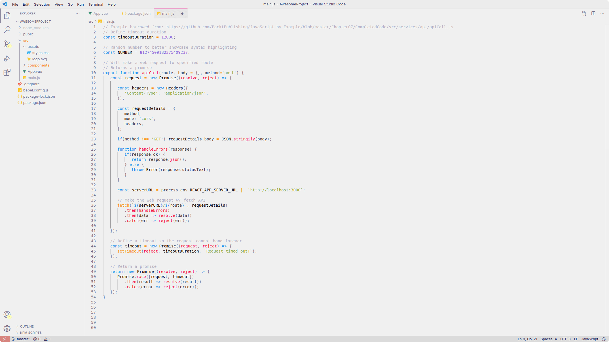
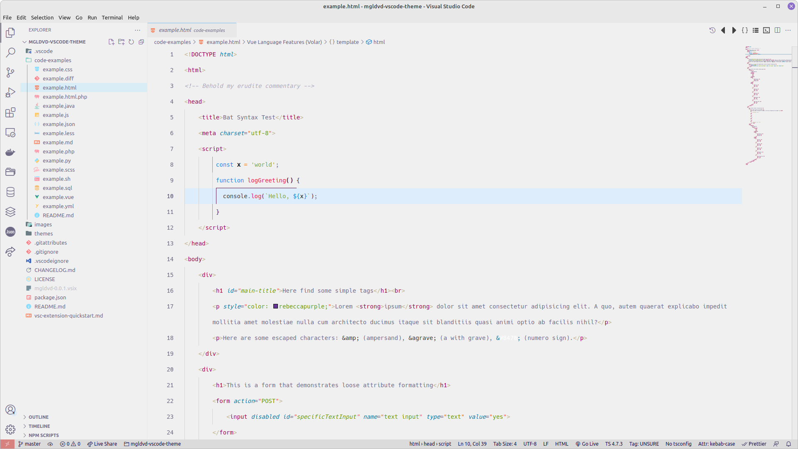
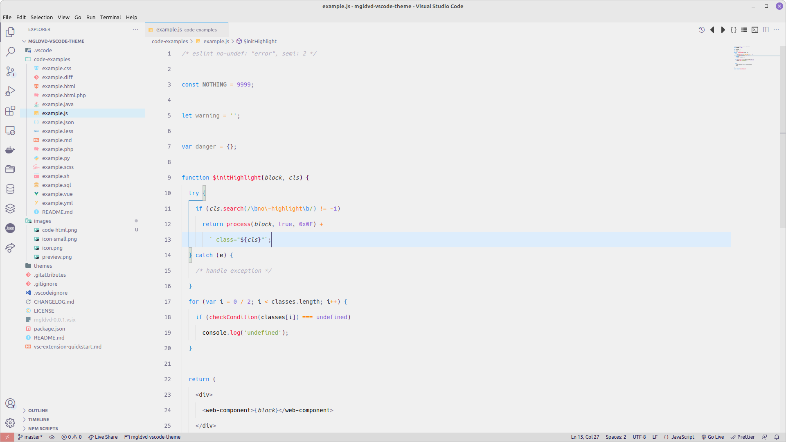
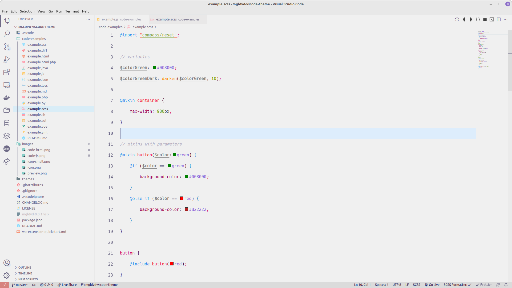
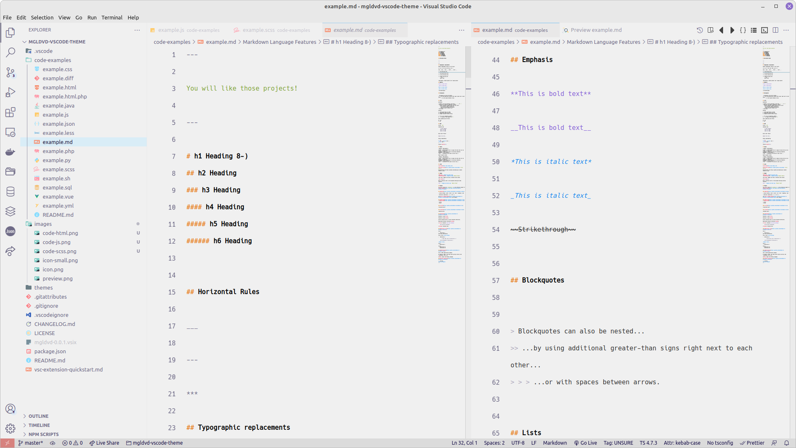

# VS Code Theme - Mgldvd

Mgldvd is a clean light theme with soft contrasts and vivid accents for code readability.

**Note** that this theme is for both **vscode** and **syntax**.


Install:

```bash
ext install Mgldvd.mgldvd
```

🔗 [Visual Studio Code | Marketplace](https://marketplace.visualstudio.com/items?itemName=Mgldvd.mgldvd)

🔗 [Theme Preview:](https://raw.githubusercontent.com/mgldvd/vscode-theme/master/images/preview.png)



---

## 🎨 Principal Colors

| Hex | Use |
|---|---|
| `#f0f0f0` | Main background |
| `#6e6a86` | Main foreground/text |
| `#d7827e` | UI accent (buttons, links) |
| `#1187EE` | Keywords / primary semantic accent |
| `#8560D7` | Constants / secondary accent |
| `#FF890C` | Operators / highlights |
| `#80A339` | Strings |
| `#F51340` | Functions / strong emphasis |

---

## 🖼️ Screenshots

### 🔗 [html](images/code-html.png):



### 🔗 [js](images/code-js.png):



### 🔗 [scss](images/code-scss.png):



### 🔗 [markdown](images/code-md.png):



---

## 🚀 Development & Release

This project uses [mise](https://mise.jdx.dev/) to manage tasks.

### Available tasks

| Command | Description |
|---|---|
| `mise run build` | Bump to next patch version and build `.vsix` |
| `mise run build-test` | Build `.vsix` without version bump (test only) |
| `mise run publish` | Publish current version and trigger GitHub Release |
| `mise run sync-colors` | Sync colors from `.vscode/settings.json` into theme JSON |
| `mise run sync-colors-dry` | Preview color sync from settings to theme (no file changes) |

### Release flow

1. Build and bump the version:

```bash
mise run build
```

2. Commit and push:

```bash
git add package.json *.vsix
git commit -m "chore(release): bump version"
git push
```

3. Publish and tag:

```bash
mise run publish
```

The publish task automatically creates and pushes the matching git tag, which triggers the GitHub Release workflow.

