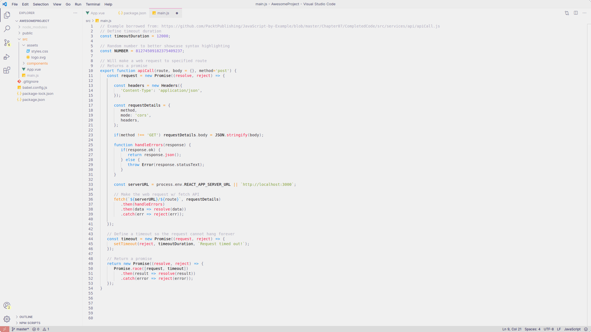

# VS Code Theme - Mgldvd

**Note** that this theme is for both **vscode** and **syntax**.


Install:

```bash
ext install Mgldvd.mgldvd
```

🔗 [Visual Studio Code | Marketplace](https://marketplace.visualstudio.com/items?itemName=Mgldvd.mgldvd)

🔗 [Theme Preview:](https://raw.githubusercontent.com/mgldvd/vscode-theme/master/images/preview.png)



---

## 🎨 Principal Colors

| Color | Hex | Use |
|---|---|---|
|  | `#f0f0f0` | Main background |
|  | `#6e6a86` | Main foreground/text |
|  | `#d7827e` | UI accent (buttons, links) |
|  | `#1187EE` | Keywords / primary semantic accent |
|  | `#8560D7` | Constants / secondary accent |
|  | `#FF890C` | Operators / highlights |
|  | `#80A339` | Strings |
|  | `#F51340` | Functions / strong emphasis |

---

## 🖼️ Screenshots

### 🔗 [html](images/code-html.png):


### 🔗 [js](images/code-js.png):


### 🔗 [scss](images/code-scss.png):


### 🔗 [markdown](images/code-md.png):


---

## 🚀 GitHub Release & Package Pipeline

This repository now includes two GitHub Actions workflows:

- **Package workflow**: builds a `.vsix` artifact when a tag like `v1.4.8` is pushed.
- **Release workflow**: creates a GitHub Release and uploads the `.vsix` when a tag like `v1.4.8` is pushed.

Workflow files:

- `.github/workflows/package.yml`
- `.github/workflows/release.yml`

### Release flow

1. Bump `version` in `package.json`
2. Commit and push
3. Create and push a matching tag:

```bash
git tag v1.4.8
git push origin v1.4.8
```

The workflow validates that tag and `package.json` version match.

