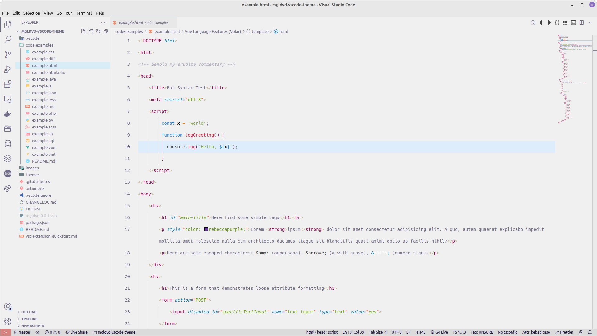
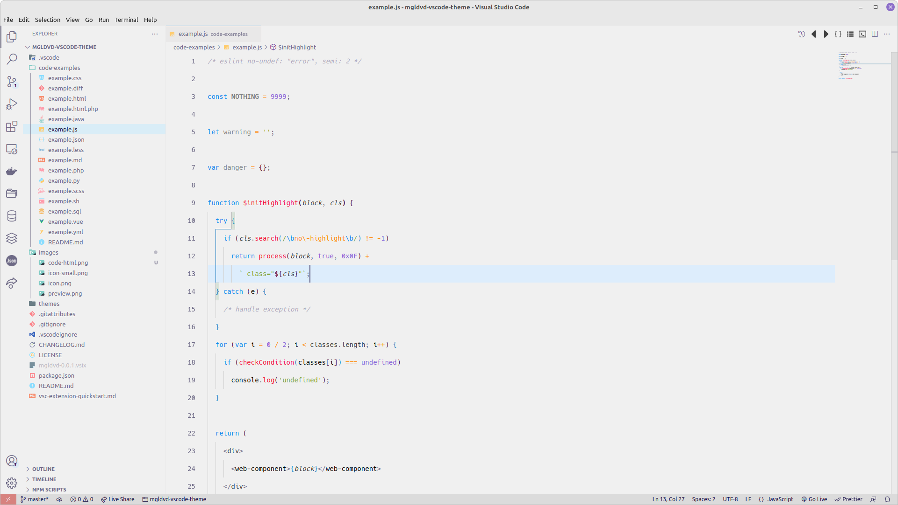

# VS Code Theme - Mgldvd

⚠️ Note that this theme is for both **vscode** and **syntax**.


Install:

```bash
ext install Mgldvd.mgldvd
```

🔗 [Visual Studio Code | Marketplace](https://marketplace.visualstudio.com/items?itemName=Mgldvd.mgldvd)

🔗 [Theme Preview:](https://raw.githubusercontent.com/mgldvd/vscode-theme/master/images/preview.png)


----------

## 🖼️ Screenshots

### [html](images/code-html.png):



### [js](images/code-js.png):



### [scss](images/code-scss.png):


### [markdown](images/code-md.png):


----------

**If you are looking for something to "README", here is something by Tolstoy:**

> All happy families are alike; each unhappy family is unhappy in its own way.

> All was confusion in the Oblonskys’ house. The wife had found out that the husband was having an affair with their former French governess, and had announced to the husband that she could not live in the same house with him. This situation had continued for three days now, and was painfully felt by the couple themselves, as well as by all members of the family and household. They felt that there was no sense in their living together and that people who meet accidentally at any inn have more connection with each other than they, the members of the family and household of the Oblonskys. The wife would not leave her rooms, the husband was away for the third day. The children were running all over the house as if lost; the English governess quarreled with the housekeeper and wrote a note to a friend, asking her to find her a new place; the cook had already left the premises the day before, at dinner-time; the kitchen-maid and coachman had given notice.

—Leo Tolstoy, Anna Karenina

Go to: https://thegreatestbooks.org/